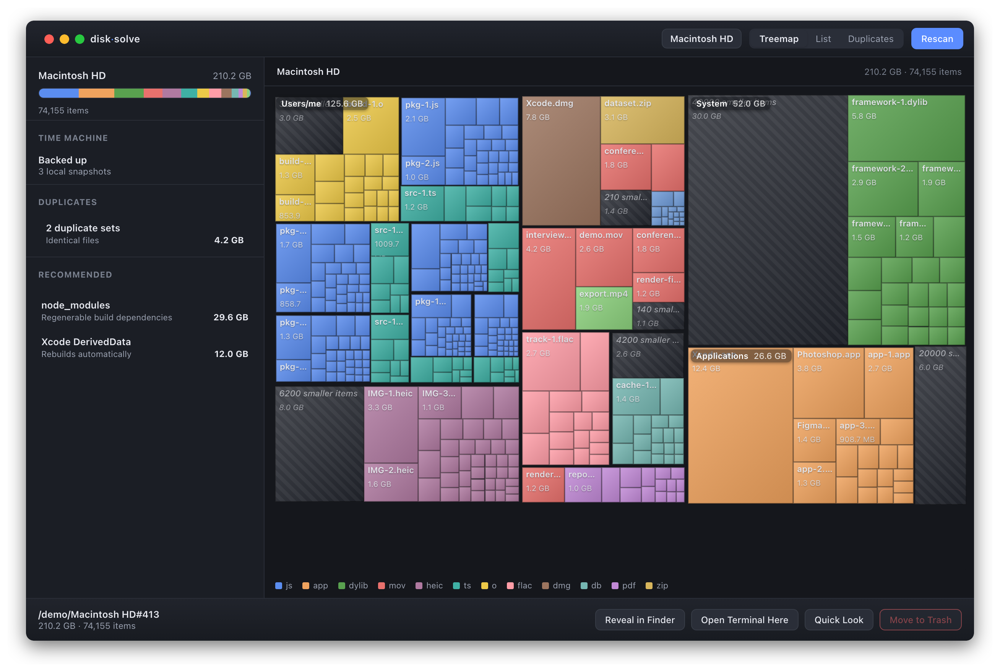
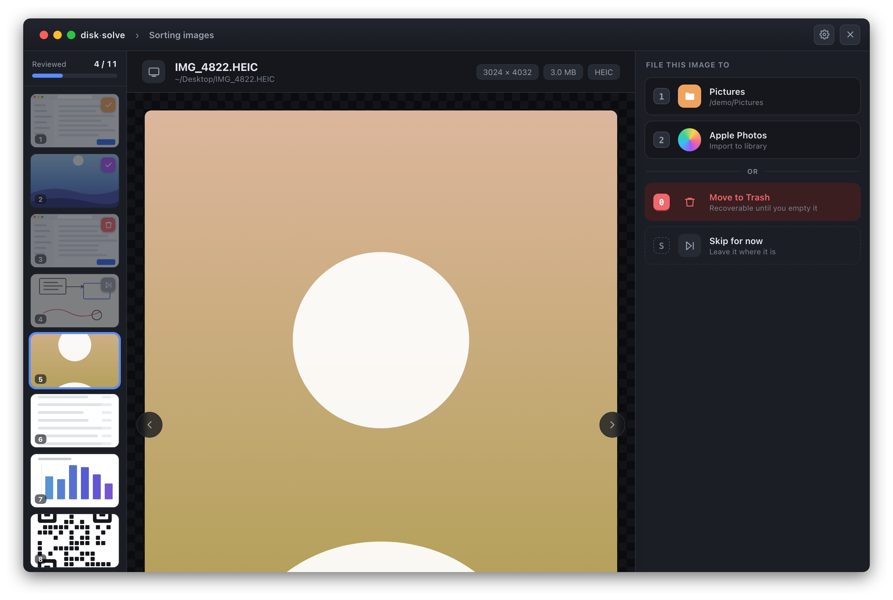
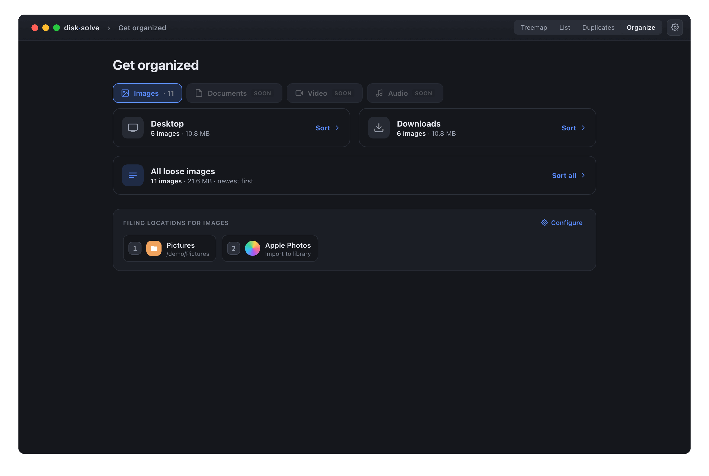
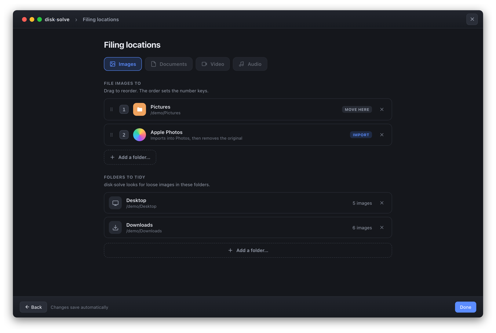
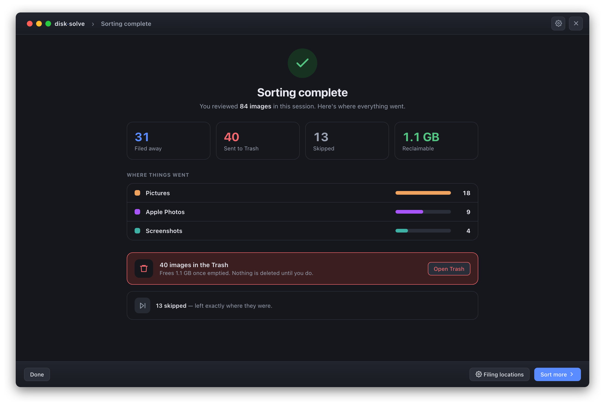

# disk-solve

A modern, open-source disk-usage steward for macOS, with organization and backup awareness. Built with
[Tauri](https://tauri.app/) and React.



A recommendation opens as a filtered, sortable list — here, every project's
`node_modules` across the disk, with on-disk size, item count, and last-modified date.  You can move unneeded files and directories to your Trash:


Duplicate detection runs on a background thread after the tree is on screen, then
groups byte-identical files so you can keep one copy and reclaim the rest:


**Get organized** turns the loose images piling up on the Desktop, in Downloads, and anywhere else
into a fast, keyboard-driven pass: view each one, then file it to a configured
location (`1`–`9`), send it to the Trash (`0`), or skip it (`s`), with multi-level
undo (`⌘Z`). Every action is a reversible move, so nothing is ever hard-deleted.



You pick a pile to work through, and the filing locations are configurable and
persist between launches — each bound to a number key, with Apple Photos available
as a destination:





When the batch is done, a summary shows where everything went and offers to empty the Trash:



> The screenshots above are generated from fabricated demo data (`makeDemoTree`
> in `src/lib/demo.ts` and `demoImages` in `src/lib/sort.ts`) — never a real disk —
> by `npm run screenshot`, which builds the UI, serves it, and captures it with
> headless Chrome. See [`scripts/screenshot.sh`](./scripts/screenshot.sh).

## Safety

The app is read-only by default and treats deletion with caution:

- The scanner only calls `lstat` (`std::fs::symlink_metadata`) and `read_dir`. It
  never opens files for writing, never deletes, and never follows symlinks. A test
  (`read_only_scan_does_not_mutate`) asserts a scan leaves every file untouched.
- Duplicate detection (`dups.rs`) is the one place that opens files — read-only, to
  hash their contents. It still never writes or deletes, and reports a duplicate only
  when a cryptographic (BLAKE3) hash matches, so distinct files are never grouped
  together. Hard links to one inode are collapsed, not reported as reclaimable.
- The **only** deletion path is "Move to Trash", which goes through the macOS Trash
  (recoverable) via the `trash` crate — never `std::fs::remove_*`.
- Every trash target passes [`safety::validate_trash_target`] first, which refuses
  anything that is not inside the scanned folder, plus system locations, the home
  directory, container roots, and symlinks. The guard is exhaustively unit-tested,
  and `move_to_trash` is structured so an invalid target never reaches the trasher.

## Develop

> [!NOTE]
> disk⋅solve currently only supports macOS.

See [the Tauri prerequisites](https://v2.tauri.app/start/prerequisites/) for the complete list of dependencies.

```sh
npm install
npm run tauri dev      # run the app
```

## Test

```sh
npm test                       # frontend logic (treemap, formatting, suggestions)
cargo test --manifest-path src-tauri/Cargo.toml   # scanner, safety guard, actions
```

## Architecture

- `src-tauri/src/scan.rs` — read-only parallel scanner (rayon); on-disk size via
  512-byte blocks, hard links counted once by `(dev, inode)`, symlinks recorded but
  not followed. Exposes live `Progress` atomics (`dirs_scanned / dirs_discovered`) that
  the scan command polls to emit a `scan-progress` event for the UI's progress bar.
- `src-tauri/src/safety.rs` — the deletion guard.
- `src-tauri/src/actions.rs` — Reveal in Finder, Open Terminal Here, Quick Look, and
  the guarded Move to Trash (with a mockable `Trasher` so tests never touch real files).
- `src-tauri/src/category.rs` — file-type classification used for treemap colors.
- `src-tauri/src/backup.rs` — Time Machine snapshot/last-backup reporting via `tmutil`.
- `src-tauri/src/dups.rs` — duplicate detection. The scan streams every file into a
  `Pipeline` that buckets by size; the moment a size has a second file, those become
  candidates and a small pool of worker threads BLAKE3-hashes them — so hashing
  overlaps the disk walk instead of waiting for it. Files with the same `(size, hash)`
  are duplicates. Emits `dup-progress`; cancels (via a generation counter) if a new
  scan starts. `find_duplicates` just waits for the streamed hashing to drain.
- `src/lib/treemap.ts` — squarified treemap layout (pure, tested).
- `src/lib/suggestions.ts` — per-category totals and reclaimable suggestions from a scan.
- `src/lib/listview.ts` — list-view sorting and recommendation filters. The treemap
  payload is pruned for size, but the backend retains the full scan so the list view
  fetches any folder's complete contents on demand (`list_children`).
- `src/lib/dups.ts` — duplicates presentation: suggested keeper per group, and keeping
  the report consistent after copies are trashed.
- `src/App.tsx` — the UI: sidebar dashboard, drill-down treemap, breadcrumb, inspector,
  the filtered list view, and the duplicates view.
- `src-tauri/src/sort.rs` + `src/SortFlow.tsx` — the "Get organized" flow: lists loose
  images in the chosen folders, then files (moves), trashes, or skips each one. Filing
  settings persist as JSON; every action is a reversible move (the in-app undo), and
  previews are shown via the asset protocol.

## License

MIT — see [LICENSE](./LICENSE).
